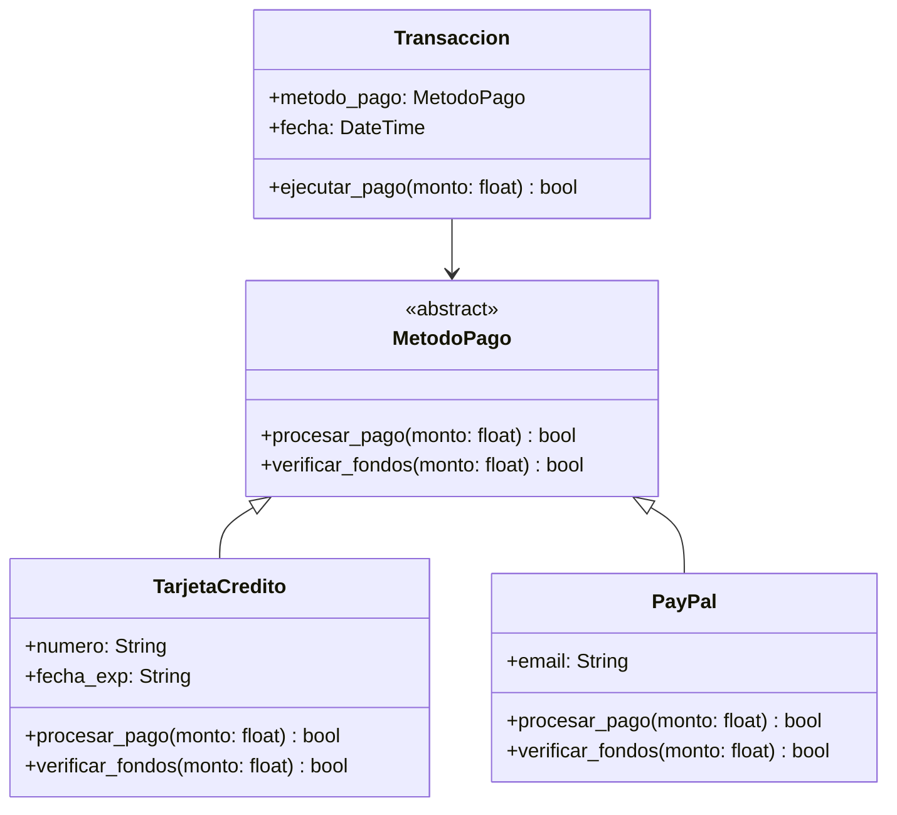

### 2.2 Ejemplo Práctico: Sistema de Pagos

```python
from abc import ABC, abstractmethod
from datetime import datetime
from typing import List, Dict

class MetodoPago(ABC):
    @abstractmethod
    def procesar_pago(self, monto: float) -> bool:
        pass
    
    @abstractmethod
    def verificar_fondos(self, monto: float) -> bool:
        pass

class TarjetaCredito(MetodoPago):
    def __init__(self, numero: str, fecha_exp: str):
        self.numero = numero
        self.fecha_exp = fecha_exp
    
    def procesar_pago(self, monto: float) -> bool:
        if self.verificar_fondos(monto):
            print(f"Procesando pago de ${monto} con tarjeta {self.numero}")
            return True
        return False
    
    def verificar_fondos(self, monto: float) -> bool:
        # Simulación de verificación de fondos
        return True

class PayPal(MetodoPago):
    def __init__(self, email: str):
        self.email = email
    
    def procesar_pago(self, monto: float) -> bool:
        if self.verificar_fondos(monto):
            print(f"Procesando pago de ${monto} con PayPal ({self.email})")
            return True
        return False
    
    def verificar_fondos(self, monto: float) -> bool:
        # Simulación de verificación de fondos
        return True

class Transaccion:
    def __init__(self, metodo_pago: MetodoPago):
        self.metodo_pago = metodo_pago
        self.fecha = datetime.now()
    
    def ejecutar_pago(self, monto: float) -> bool:
        return self.metodo_pago.procesar_pago(monto)
```
#### Diagrama de Clases

